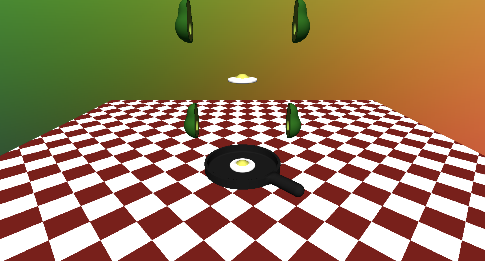
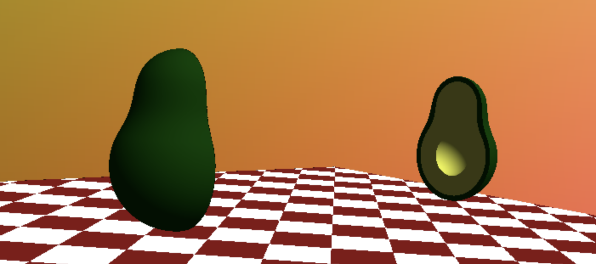
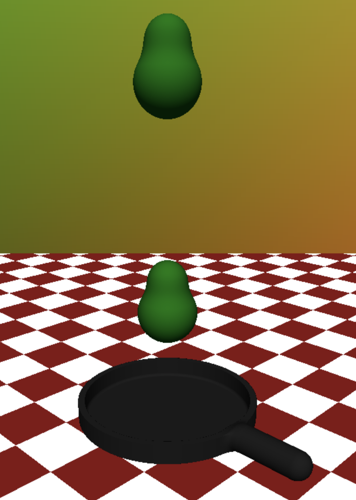
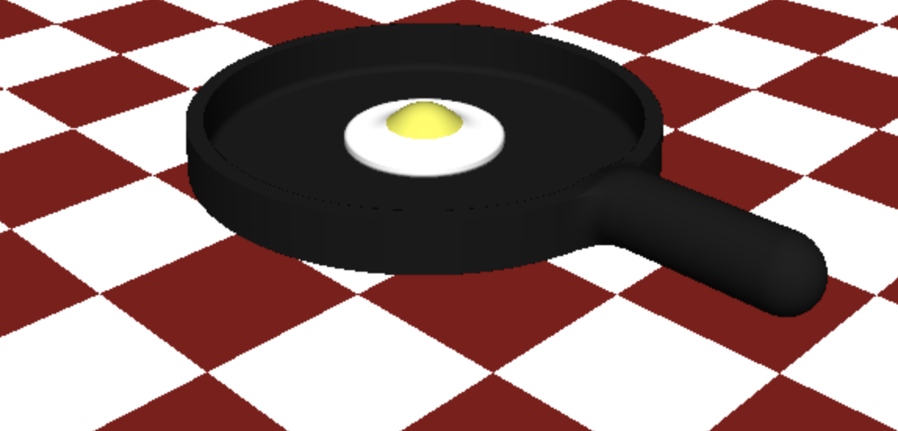
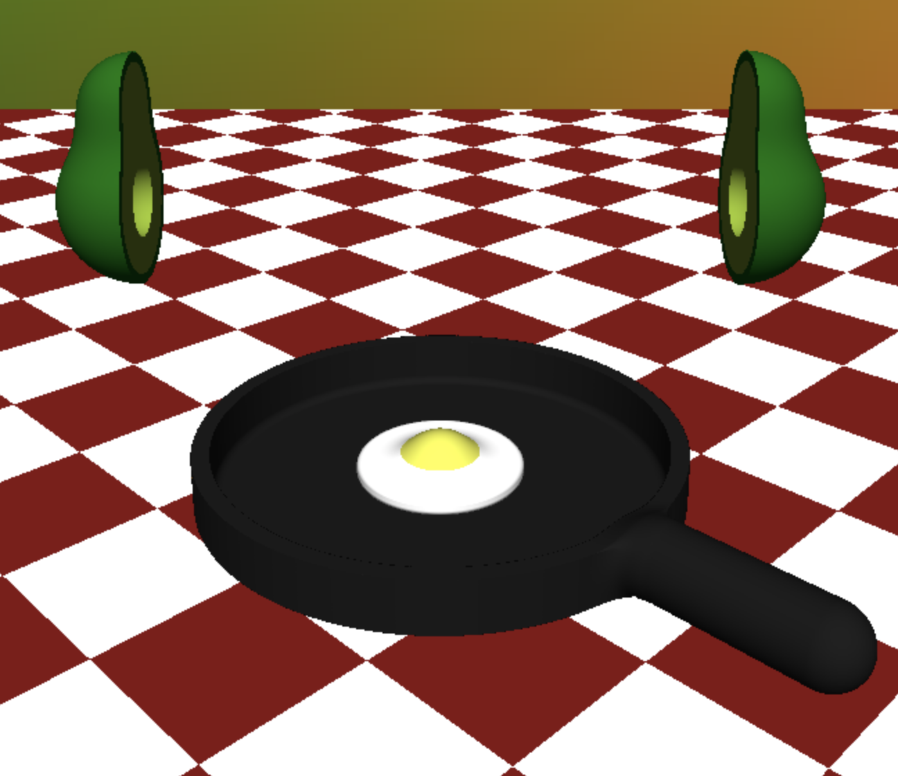
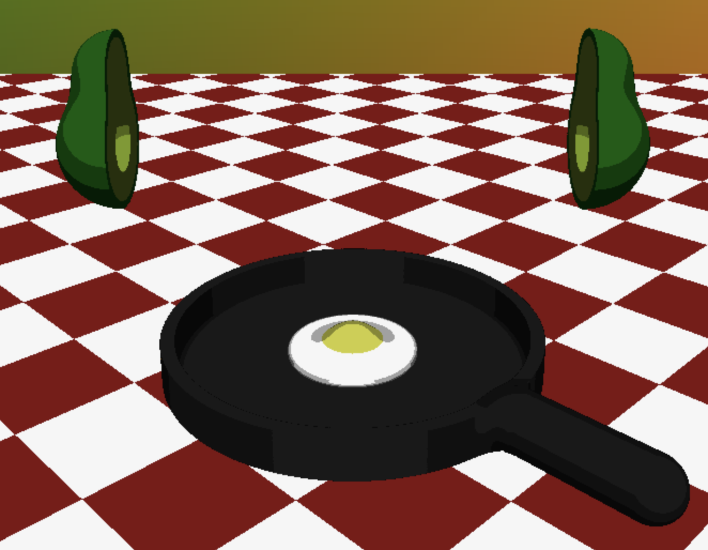

Breakfast Time
=====================================

A project by Nicholas Keenan (pennkey: nkeenan).
Demo Link: https://nkeenan38.github.io/hw02-raymarching-sdfs

Avocados
--------------

The avocados halves are made with the smooth union of two spheres to get the characteristic avocado shape. A box the size of half the avocado is subtracted from this shape. The resulting shape is reflected across the x-axis to create the two halves coming together and apart. Simalrly, a sphere where the avocado seed should be is subtracted from this shape. The animation is created by adding the output of a gain function to the x-ccordinate of the avocado times some amplitude. The avocados are repeated infinitely in the y-direction by modding the y-coordinate of p. Green is the default color of the scene that changes if certain conditions are met. For the avocado, if the box subtracts from the point we are rendering, the surface is colored yellow (except for a small radius around the edge).

Avocado Pit / Egg Yolk
------

The avocado seed is a simple sphere. It is animated using the same gain function as the avocados. The color is a mix of brown and yellow with the output of this gain function as the input. So it is more brown around 0 (when it is in and near the avocado). It becomes yellow and transforms into the yolk on its way down to and in the pan. The animation of the seed falling down to the next level is creating by modding the gain function. So while it looks like the seeds fall down to the next level, each seed actually just stays in the same one with a ncie transition when it wraps around to the top.

Egg Whites
------

The egg is created with the smooth union of the egg yolk and a white rounded cylinder. The cylinder expands with a discontinuous function based on the seed's gain function, so that it only grows when the seed is in contact, and completely disappears when the yolk moves away. 

Table and Frying Pan
------

The base of the pan is made by subtracting a cylinder from a slightly larger cylinder. Then smooth union a rounded cylinder for the handle. The table pattern is creating by taking the floor of the sum of two sin functions. This value is used to select whether the output color should be red or white.

Additional Effects
------

Select shading mode to swap between a typical lambertian shader and a toon shader. 

Vary the ripeness level to change the color of the avocado to match.

